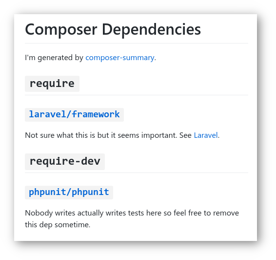

# composer-summary

Zero-friction tool to document your composer dependencies. 

<table>
<tbody>
<tr>
<td>

```json
{
  "require": {
    "laravel/framework": "5.2.*"
  },
  "require-dev": {
    "phpunit/phpunit": "~4.0"
  }
}
```

</td>
</tr>

<tr>
<td>

`composer-summary composer.json` ⬇️

</td>
</tr>

<tr>
<td>



</td>
</tr>
</tbody>
</table>

* * *
**This is a prototype: please check [this milestone](https://github.com/oncarrot/composer-summary/milestone/1)**

This is currently just a quick sketch I did in Ruby. We probably have to rewrite this in PHP and make it installable via Composer as a require-dev dep.  
—Austin
* * *

## Usage

This isn't published on a package registry yet or anything so feel free to just clone the repo and install it as a gem.
It requires a somewhat modern version of Ruby (2.5+).

```bash
git clone https://github.com/oncarrot/composer-summary.git
cd composer-summary
make install
```

```bash
composer-summary --help

# will generate path/to/your/composer.md
composer-summary path/to/your/composer.json

# generate a markdown file somewhere else
composer-summary path/to/your/composer.json path/to/your/docs/muh-composer-deps.md
```

If you hate it just uninstall it `gem uninstall composer-summary`

## Development

Run the tests with `make test`
